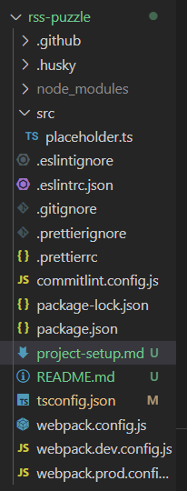

# Setup

## .editorconfig

```
root = true

[*]
charset = utf-8
end_of_line = lf
insert_final_newline = true
trim_trailing_whitespace = true
indent_size = 2
indent_style = space
```

## Technology stack

- Eslint
- Prettier
- Husky
- Webpack
- Typescript



## package.json

```
{
  "name": "rss-puzzle",
  "version": "1.0.0",
  "description": "RSS-puzzle",
  "main": "index.ts",
  "private": true,
  "devDependencies": {
    "@commitlint/cli": "^19.0.3",
    "@commitlint/config-conventional": "^19.0.3",
    "@typescript-eslint/eslint-plugin": "^7.1.1",
    "css-loader": "^6.10.0",
    "eslint": "^8.2.0",
    "eslint-config-prettier": "^9.1.0",
    "eslint-import-resolver-typescript": "^3.6.1",
    "eslint-plugin-import": "^2.29.1",
    "eslint-webpack-plugin": "^4.0.1",
    "html-webpack-plugin": "^5.6.0",
@typescript-eslint/parser // установить
    "husky": "^9.0.11",
    "prettier": "3.1.1",
    "style-loader": "^3.3.4",
    "ts-loader": "^9.5.1",
    "tsconfig-paths-webpack-plugin": "^4.1.0",
    "typescript": "^5.4.2",
    "webpack-cli": "^5.1.4",
    "webpack-dev-server": "^5.0.2"
  },
  "scripts": {
    "format:fix": "prettier --write .",
    "lint": "eslint .  --no-error-on-unmatched-pattern   --ext ts ",
    "lint:fix": "eslint . --fix --ext ts",
    "prepare": "husky",
    "start": "webpack serve --open --config ./webpack.config.js --env mode=dev",
    "build": "webpack --config ./webpack.config.js --env mode=prod"
  },
  "author": "Kate Goncharik",
  "license": "ISC"
}

```

### Eslint

1. Install -

- "@typescript-eslint/eslint-plugin": "^7.1.1",
- "eslint": "^8.2.0",
- "eslint-config-prettier": "^9.1.0",
- "eslint-plugin-import": "^2.29.1",

2. Configure .eslintrc.json

```
{
  "parser": "@typescript-eslint/parser",
  "plugins": ["import", "@typescript-eslint"],
  "extends": ["eslint:recommended", "plugin:@typescript-eslint/recommended", "plugin:import/recommended", "prettier"],
  "parserOptions": {
    "ecmaVersion": 2020,
    "sourceType": "module"
  },
  "env": {
    "es6": true,
    "browser": true,
    "node": true
  },
  "rules": {
    "curly": ["error", "all"],
    "@typescript-eslint/no-explicit-any": "error",
    "@typescript-eslint/no-var-requires": "off",
    "@typescript-eslint/explicit-function-return-type": "error",
    "no-debugger": "off",
    "no-console": "off",
    "class-methods-use-this": "on" // не стоит отключать
  },
  "settings": {
    "import/extensions": [".ts"],
    "import/resolver": {
      "typescript": true
    },
    "import/parsers": {
      "@typescript-eslint/parser": [".ts"]
    }
  }
}
```

3. Configure .eslintignore

```
dist
node_modules
**/*.js
```

4. Add script

```
"lint": "eslint . --ext ts ", // --no-error-on-unmatched-pattern, if there are no ts files yet
"lint:fix": "eslint . --fix --ext ts",
```

## Prettier

1. Install
   "prettier": "3.1.1"
2. Configure .prettierc

```json
{
  "trailingComma": "all", // default
  "semi": true,
  "singleQuote": true,
  "printWidth": 120
}
```

3. Configure .prettierignore

```
.prettierignore
dist
node_modules
assets
**/*.js // можно убрать
```

4. Add script

```json
"format:fix": "prettier --write .",
```

## Husky

(It has to be on the same level with .git)

1. Install

```json
"husky": "^9.0.11",
```

2. Configure hooks

- pre-commit:

```json

npm run format:fix

```

- pre-push:

```json

npm run lint
npm run format:fix

```

(requires config 'commitlint.config.js')

- commit-msg:

```json

npx --no -- commitlint --edit ${1}

```

### commitlint.config.js

```js
module.exports = { extends: ['@commitlint/config-conventional'] };
```

## Webpack

1. Install

```json
"webpack-cli": "^5.1.4",
"eslint-webpack-plugin": "^4.0.1",
"html-webpack-plugin": "^5.6.0",
"style-loader": "^3.3.4",
"ts-loader": "^9.5.1",
"css-loader": "^6.10.0",
```

2. Configure webpack.config.js

```js
const path = require('path');
const { merge } = require('webpack-merge');
const HtmlWebpackPlugin = require('html-webpack-plugin');
const EslintPlugin = require('eslint-webpack-plugin');
const TsconfigPathsPlugin = require('tsconfig-paths-webpack-plugin');

const baseConfig = {
  entry: path.resolve(__dirname, './index'),
  mode: 'development',
  module: {
    rules: [
      {
        test: /\.ts$/i,
        use: 'ts-loader',
      },
      {
        test: /\.css$/i,
        use: ['style-loader', 'css-loader'],
      },
      {
        test: /.(png|svg|jpg|jpeg|gif|woff(2)?)$/i,
        type: 'asset/resource',
      },
    ],
  },
  resolve: {
    extensions: ['.ts', '.js'],
    plugins: [new TsconfigPathsPlugin()],
  },
  output: {
    filename: 'index.js',
    path: path.resolve(__dirname, './dist'),
    clean: true,
  },
  plugins: [
    new EslintPlugin({ extensions: 'ts' }),
    new HtmlWebpackPlugin({
      template: path.resolve(__dirname, './index.html'),
      filename: 'index.html',
      favicon: './src/assets/icons/favicon.jpg',
    }),
  ],
};

module.exports = ({ mode }) => {
  const isProductionMode = mode === 'prod';
  const envConfig = isProductionMode ? require('./webpack.prod.config') : require('./webpack.dev.config');

  return merge(baseConfig, envConfig);
};

```

3. Configure webpack.dev.config.js

```js
const path = require('path');

module.exports = {
  mode: 'development',
  devtool: 'inline-source-map',
  devServer: {
    static: {
      directory: path.resolve(__dirname, '../dist'),
    },
    compress: true,
    port: 9000,
    hot: true,
    historyApiFallback: true,
  },
```

4. Configure webpack.prod.config.js

```js
module.exports = {
  mode: 'production',
};
```

5. Add scripts

```json
"start": "webpack serve --open --config ./webpack.config.js --env mode=dev",
"build": "webpack --config ./webpack.config.js --env mode=prod",
```


**UPDATE** 
```
import type { Configuration } from 'webpack';
import type { WebpackConfig, WebpackBuildMode } from '@/config/webpack/types';
import path from 'node:path';
import { fileURLToPath } from 'node:url';
import { buildLoaders } from '@/config/webpack/buildLoaders';
import { buildPlugins } from '@/config/webpack/buildPlugins';
import { buildResolvers } from '@/config/webpack/buildResolvers';
import { buildOptimization } from '@/config/webpack/buildOptimization';
import { buildDevServer } from '@/config/webpack/buildDevServer';

const DEFAULT_DEV_SERVER_PORT = 8080;

const TRANSPILATION_TARGET = 'es2015';

const projectDirname = path.dirname(fileURLToPath(import.meta.url));

const getConfig = (mode: WebpackBuildMode, port: number): WebpackConfig => {
  return {
    mode,
    transpilationTarget: TRANSPILATION_TARGET,
    devServerPort: port,
    paths: {
      faviconPath: path.join(projectDirname, 'src', 'assets', 'favicon.svg'),
      templatePath: path.join(projectDirname, 'src', 'index.html'),
      tsConfigPath: path.join(projectDirname, 'tsconfig.json'),
    },
  };
};

export default (env: Record<string, string | boolean>, argv: Record<string, string>): Configuration => {
  const mode = argv.mode === 'development' ? 'development' : 'production';
  const devServerPort = Number(env.PORT ?? DEFAULT_DEV_SERVER_PORT);
  const isDev = mode === 'development';
  const isProd = !isDev;

  const config = getConfig(mode, devServerPort);

  const webpackConfig: Configuration = {
    mode: config.mode,
    context: path.join(projectDirname, 'src'),
    entry: { bundle: './index.js' },
    output: {
      filename: '[name]-[contenthash].js',
      clean: true,
    },
    devtool: isDev && 'eval-cheap-module-source-map',
    plugins: buildPlugins(config),
    module: {
      rules: buildLoaders(config),
    },
    resolve: buildResolvers(),
    devServer: buildDevServer(config),
  };

  if (isProd) {
    webpackConfig.optimization = buildOptimization(config);
  }

  return webpackConfig;
};
``` 

## Typescript

1. Install

```json
"typescript": "^5.4.2", // npm i typescript --save-dev

```

2. Init TS

```txt
npx tsc --init
```

3. Configure tsconfig.json

```json
{
  "compilerOptions": {
    /* Essential defaults */
    "esModuleInterop": true /* CJS/ESM interop */,
    "skipLibCheck": true /* Do not check declaration files in node_modules/ */,
    "target": "es2022" /* Ignored by Vite bundler https://vitejs.dev/guide/features.html#target */,
    "allowJs": true /* set to false if migration from JS to TS is not needed */,
    "verbatimModuleSyntax": true /* Remove every import/export with 'type' modifier during transpilation */,
    "resolveJsonModule": true /* allow importing JSON files as modules */,
    "isolatedModules": true /* warns when writing code that can’t be correctly interpreted by a single-file transpilation process */,
    "moduleDetection": "force" /* every non-declaration file is treated as a module */,
    "useDefineForClassFields": true /* conform to ECMA standard for class field syntax */,
    "allowSyntheticDefaultImports": true,

    /* Strictness */
    "strict": true /* most important option which enables many other strict options */,
    "noImplicitAny": true /* not needed (auto-enabled when 'strict: true'), but required by RS School */,
    "noUncheckedIndexedAccess": true /* forbids unsafe indexing of Records and arrays */,

    /* Transpilation performed by bundler */
    "moduleResolution": "bundler" /* use bundler's module resolution, should be enabled in all Webpack / Vite projects */,
    "module": "ESNext" /* used module system */,
    "noEmit": true /* Don't emit outputs, only perform type-checking */,

    /* DOM types for frontend projects */
    "lib": ["es2022", "dom", "dom.iterable"],

    /* Path aliases */
    "baseUrl": "",
    "paths": {
      "@/*": ["./src/*"]
    }
  },
  "include": ["**/*.ts"]
}
```
